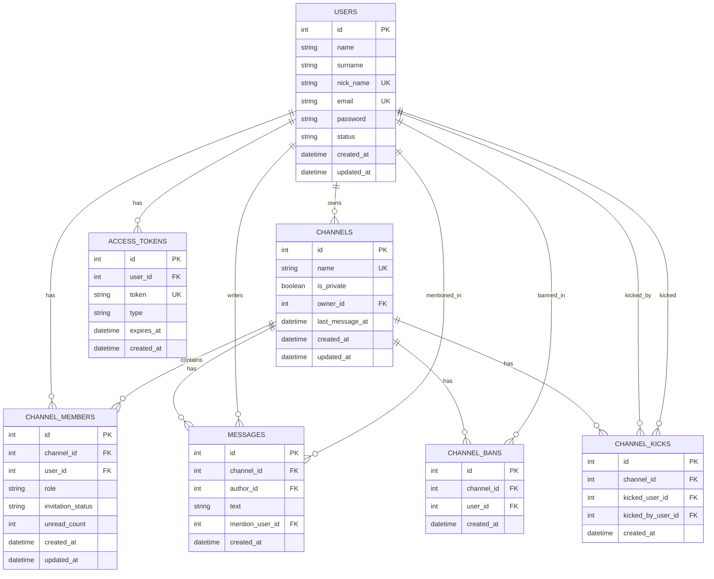
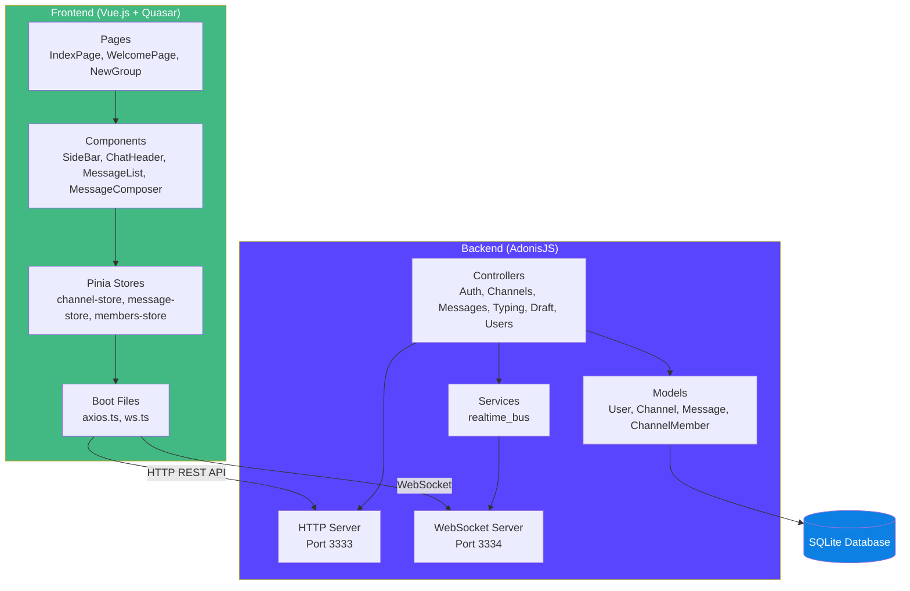
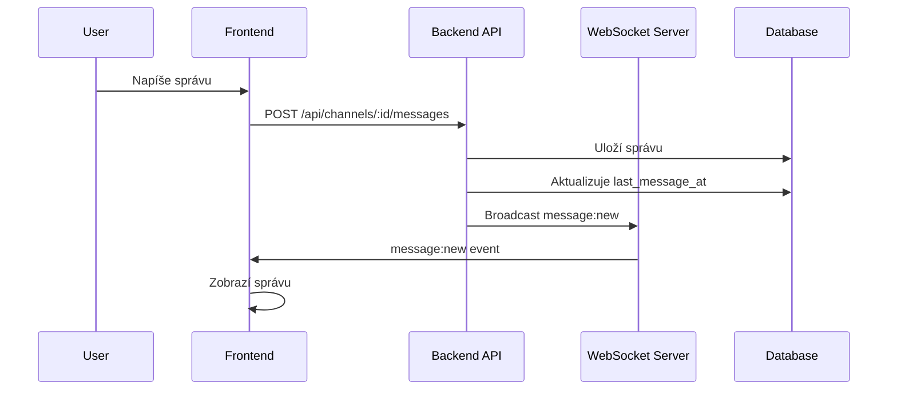
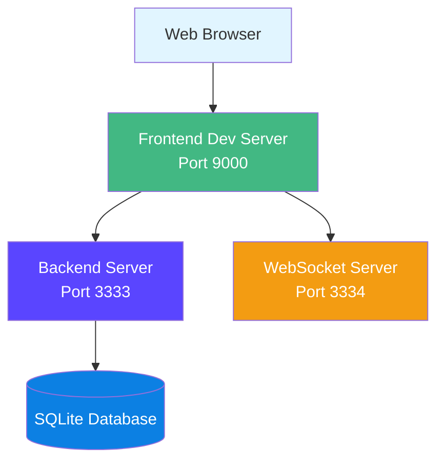

# 📚 Dokumentácia - Loom Chat

## 1. Zadanie

### 1.1 Popis projektu

Loom Chat je real-time chat aplikácia, ktorá umožňuje používateľom vytvárať skupiny (kanály), posielať správy a komunikovať v reálnom čase. Aplikácia podporuje súkromné aj verejné skupiny, správu používateľov, statusy (Online/DND/Offline) a automatické čistenie neaktívnych kanálov.

### 1.2 Hlavné požiadavky

- **Real-time komunikácia** - Okamžité odosielanie a prijímanie správ cez WebSocket
- **Správa skupín** - Vytváranie, opúšťanie, mazanie skupín
- **Autentifikácia** - Registrácia, prihlásenie, odhlásenie používateľov
- **Statusy používateľov** - Online, DND (Do Not Disturb), Offline
- **Typing indikátory** - Zobrazenie, kto práve píše správu
- **Draft preview** - Náhľad textu, ktorý niekto píše v reálnom čase
- **Notifikácie** - Inteligentné notifikácie s App Visibility API
- **Pozvánky** - Pozývanie používateľov do skupín
- **Kick systém** - 3-kick permanent ban systém
- **Automatické čistenie** - Mazanie neaktívnych kanálov po 30 dňoch

### 1.3 Technické požiadavky

- Frontend: Vue.js 3.5 + Quasar Framework
- Backend: AdonisJS 6.18
- Databáza: SQLite
- Real-time: WebSocket (ws)
- Typing: TypeScript

---

## 2. Diagram fyzického dátového modelu

### 2.1 ER Diagram

### 2.2 Zmeny oproti 2. fáze

#### Pridané stĺpce:

1. **`users.status`** (migrácia: `1765641020156_create_add_status_to_users_table.ts`)
   - **Typ**: `string` (enum: 'online', 'DND', 'offline')
   - **Zdôvodnenie**: Potrebné pre správu statusov používateľov (Online/DND/Offline). Umožňuje používateľom nastaviť svoj status a ostatným vidieť, či je používateľ dostupný.

2. **`channels.last_message_at`** (migrácia: `1765653970445_create_add_last_message_at_to_channels_table.ts`)
   - **Typ**: `datetime` (nullable)
   - **Zdôvodnenie**: Potrebné pre automatické mazanie neaktívnych kanálov po 30 dňoch. Umožňuje identifikovať, kedy bol kanál naposledy aktívny.

#### Vzťahy:

- Všetky vzťahy zostali zachované z 2. fázy
- Pridané vzťahy sú len logické (status používateľa nie je foreign key)

---

## 3. Diagram architektúry aplikácie

### 3.1 Komponentový diagram

### 3.2 Sekvenčný diagram - Odoslanie správy

### 3.3 Deployment diagram

---

## 4. Návrhové rozhodnutia

### 4.1 Frontend knižnice

#### Vue.js 3.5
- **Zdôvodnenie**: Moderný, výkonný framework s Composition API. Výborná podpora pre TypeScript a reaktivitu.
- **Alternatívy**: React, Angular - Vue.js je jednoduchší na učenie a má lepšiu integráciu s Quasar.

#### Quasar Framework 2.16
- **Zdôvodnenie**: Kompletný UI framework s množstvom komponentov out-of-the-box. Responzívny dizajn a tmavý motív sú zabudované.
- **Alternatívy**: Vuetify, Element Plus - Quasar má lepšiu podporu pre PWA a mobilné aplikácie.

#### Pinia
- **Zdôvodnenie**: Oficiálny state management pre Vue.js 3. Jednoduchší ako Vuex, lepšia TypeScript podpora.
- **Alternatívy**: Vuex - Pinia je novší a odporúčaný pre Vue 3.

#### Axios
- **Zdôvodnenie**: Populárna HTTP knižnica s dobrým error handlingom a interceptormi.
- **Alternatívy**: Fetch API - Axios má lepšiu podporu pre interceptory a automatické JSON parsing.

### 4.2 Backend knižnice

#### AdonisJS 6.18
- **Zdôvodnenie**: Full-stack Node.js framework s MVC architektúrou. Výborná podpora pre TypeScript, ORM a migrácie.
- **Alternatívy**: Express, NestJS - AdonisJS má lepšiu štruktúru a zabudované nástroje.

#### SQLite (better-sqlite3)
- **Zdôvodnenie**: Jednoduchá, bezserverová databáza. Ideálna pre development a malé až stredné aplikácie.
- **Alternatívy**: PostgreSQL, MySQL - SQLite je jednoduchšia na setup a nevyžaduje samostatný server.

#### WebSocket (ws)
- **Zdôvodnenie**: Štandardná WebSocket implementácia pre Node.js. Jednoduchá a výkonná.
- **Alternatívy**: Socket.io - `ws` je jednoduchšia a má menšiu veľkosť.

#### Luxon
- **Zdôvodnenie**: Moderná JavaScript knižnica pre prácu s dátumami a časom. Lepšia ako Moment.js.
- **Alternatívy**: Moment.js, date-fns - Luxon je moderná a immutable.

#### adonisjs-scheduler
- **Zdôvodnenie**: Oficiálna knižnica pre scheduled tasks v AdonisJS. Jednoduchá na použitie.
- **Alternatívy**: node-cron - Integrácia s AdonisJS je lepšia.

### 4.3 Architektúrne rozhodnutia

#### Monorepo štruktúra
- **Zdôvodnenie**: Oddelenie frontendu a backendu do samostatných aplikácií v jednom repozitári. Jednoduchšia správa závislostí a deployment.

#### WebSocket pre real-time komunikáciu
- **Zdôvodnenie**: WebSocket poskytuje obojsmernú komunikáciu v reálnom čase. Lepšie ako polling alebo Server-Sent Events pre chat aplikácie.

#### JWT autentifikácia
- **Zdôvodnenie**: Stateless autentifikácia, ktorá nevyžaduje session storage. Jednoduchšia na implementáciu a škálovanie.

#### Message queuing pre offline používateľov
- **Zdôvodnenie**: Keď je používateľ offline, správy sa ukladajú do fronty a zobrazia sa po pripojení. Zlepšuje používateľskú skúsenosť.

#### Automatické mazanie neaktívnych kanálov
- **Zdôvodnenie**: Udržiava databázu čistú a odstraňuje nepotrebné dáta. Scheduler beží každý deň o 3:00.

---

## 5. Snímky obrazoviek

> **Poznámka**: Screenshoty by mali byť uložené v priečinku `screenshots/` v root adresári projektu. Nasledujúce screenshoty sú kľúčové pre prezentáciu aplikácie:

### 5.1 Prihlasovacia stránka
**Cesta**: `screenshots/01-login.png`  
*Prihlasovacia stránka s možnosťou registrácie. Jednoduchý a čistý dizajn s tmavým motívom.*

### 5.2 Welcome stránka
**Cesta**: `screenshots/02-welcome.png`  
*Welcome stránka po prihlásení. Zobrazuje informácie o aplikácii, možnosti vytvorenia novej skupiny a zoznam existujúcich skupín.*

### 5.3 Chat rozhranie
**Cesta**: `screenshots/03-chat.png`  
*Hlavné chat rozhranie so zoznamom kanálov vľavo a chatom vpravo. Zobrazuje správy v reálnom čase, header s informáciami o kanáli a message composer.*

### 5.4 Typing indikátor
**Cesta**: `screenshots/04-typing.png`  
*Typing indikátor zobrazujúci, kto práve píše správu. Zobrazuje aj draft text v reálnom čase v popup okne.*

### 5.5 Zoznam členov
**Cesta**: `screenshots/05-members.png`  
*Zoznam členov skupiny s ich statusmi (Online/DND/Offline). Možnosť pozvať nových členov, vyhodiť členov a zobraziť informácie o skupine.*

### 5.6 Status nastavenie
**Cesta**: `screenshots/06-status.png`  
*Nastavenie statusu používateľa (Online/DND/Offline). Dropdown menu v sidebar s vizuálnymi indikátormi pre každý status.*

### 5.7 Notifikácie
**Cesta**: `screenshots/07-notifications.png`  
*Notifikácie sa zobrazujú len keď je aplikácia skrytá. Podporuje preferencie (všetko/iba mentions/muted). Zobrazenie notifikácie v prehliadači.*

### 5.8 Vytvorenie novej skupiny
**Cesta**: `screenshots/08-new-group.png`  
*Formulár na vytvorenie novej skupiny s možnosťou nastavenia názvu, typu (súkromná/verejná) a pozvania členov.*

---

## 6. Záver

Aplikácia Loom Chat je plne funkčná real-time chat aplikácia s modernou architektúrou a používateľsky prívetivým rozhraním. Všetky požadované funkcie sú implementované a aplikácia je pripravená na nasadenie.

### 6.1 Implementované funkcie

✅ Real-time messaging cez WebSocket  
✅ Správa skupín (vytváranie, opúšťanie, mazanie)  
✅ Statusy používateľov (Online/DND/Offline)  
✅ Typing indikátory s draft preview  
✅ Notifikácie s App Visibility API  
✅ Pozvánky a kick systém  
✅ Automatické mazanie neaktívnych kanálov  
✅ Responzívny dizajn  

### 6.2 Technické špecifikácie

- **Frontend**: Vue.js 3.5 + Quasar Framework
- **Backend**: AdonisJS 6.18
- **Databáza**: SQLite
- **Real-time**: WebSocket (ws)
- **Typing**: TypeScript

---

**Autor**: MrM4r3k  
**Dátum**: 2024  
**Verzia**: 1.0

