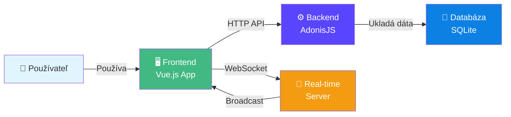

# 💬 Loom Chat

Moderná chat aplikácia s real-time komunikáciou. Vytvárajte skupiny, posielajte správy a komunikujte s priateľmi v reálnom čase.


## 📋 Obsah

- [Prehľad](#-prehľad)
- [Funkcie](#-funkcie)
- [Technológie](#-technológie)
- [Inštalácia](#-inštalácia)
- [Spustenie](#-spustenie)
- [Štruktúra projektu](#-štruktúra-projektu)
- [API Endpoints](#-api-endpoints)
- [WebSocket Events](#-websocket-events)
- [Databáza](#-databáza)
- [📚 Kompletná dokumentácia](DOCUMENTACIA.md)

## 🎯 O čom to je?

Loom Chat je chat aplikácia, kde môžete vytvárať skupiny, posielať správy a komunikovať s priateľmi. Všetko sa deje v reálnom čase - keď niekto napíše správu, vidíte ju okamžite.

### Čo všetko umie?

- 💬 **Okamžité správy** - Správy sa zobrazujú hneď, bez obnovenia stránky
- 👥 **Skupiny** - Vytvárajte súkromné alebo verejné skupiny
- ✍️ **Vidíte, kto píše** - Indikátor, že niekto práve píše správu
- 🔔 **Notifikácie** - Upozornenia na nové správy
- 🎭 **Statusy** - Online, DND (Neruš), alebo Offline
- 👤 **Pozvánky** - Pozývajte ľudí do skupín
- 🗑️ **Automatické čistenie** - Neaktívne skupiny sa po 30 dňoch zmazú

## ✨ Čo všetko môžete robiť?

### Chatovanie
- Píšte správy, ktoré sa zobrazujú okamžite
- Vidíte, keď niekto práve píše
- Spomínajte ľudí pomocou @nickname
- Keď ste offline, správy sa uložia a zobrazia sa, keď sa pripojíte

### Skupiny
- Vytvárajte súkromné alebo verejné skupiny
- Pozývajte ľudí do skupín
- Vlastník skupiny má špeciálne oprávnenia
- Neaktívne skupiny sa po 30 dňoch automaticky zmazú

### Statusy
- **Online** - Ste pripojený a aktívny
- **DND (Neruš)** - Nechcete byť rušení, ale stále vidíte správy
- **Offline** - Odpojíte sa, správy sa uložia na neskôr

### Notifikácie
- Notifikácie len keď nie ste na stránke
- Môžete si nastaviť preferencie (všetko / iba spomenutia / vypnuté)

### Ako to funguje?



**Jednoducho povedané:**
- Frontend je to, čo vidíte v prehliadači
- Backend spracováva požiadavky a ukladá dáta
- WebSocket zabezpečuje, že správy prichádzajú okamžite
- Databáza ukladá všetky informácie

## 🛠 Čo je pod kapotou?

### Frontend
- **Vue.js** - Moderný JavaScript framework
- **Quasar** - UI komponenty a styling
- **TypeScript** - Typovaný JavaScript
- **Pinia** - Správa stavu aplikácie
- **WebSocket** - Real-time komunikácia

### Backend
- **AdonisJS** - Node.js framework
- **SQLite** - Jednoduchá databáza
- **WebSocket** - Real-time server
- **Scheduler** - Automatické úlohy (čistenie neaktívnych skupín)

## 🚀 Ako to spustiť?

### Čo potrebujete
- Node.js (verzia 20 alebo novšia)
- npm

### Postup

1. **Stiahnite si projekt**
```bash
git clone <repository-url>
cd VPWA
```

2. **Nainštalujte závislosti**
```bash
npm install
cd apps/api && npm install
cd ../web && npm install
```

3. **Nastavte databázu**
```bash
cd apps/api
node ace migration:run
```

4. **Spustite aplikáciu**
```bash
# Z root adresára
npm run dev
```

To spustí oba servery naraz - backend aj frontend. Aplikácia bude dostupná na `http://localhost:9000`

## 💻 Príkazové riadky

### Development
```bash
npm run dev          # Spustí backend aj frontend naraz
npm run dev:api      # Len backend
npm run dev:web      # Len frontend
```

### Production
```bash
cd apps/api
npm run build && npm start

cd apps/web
npm run build
# Potom nasaďte obsah priečinka dist/
```

## 📁 Štruktúra projektu

```
VPWA/
├── apps/
│   ├── api/          # Backend - API a WebSocket server
│   └── web/          # Frontend - Vue.js aplikácia
└── README.md
```

Všetko dôležité je v `apps/` priečinku - backend v `api/` a frontend v `web/`.

## 🔌 API

Aplikácia má REST API pre všetky operácie:
- Autentifikácia (login, register, logout)
- Správa skupín (vytvorenie, opustenie, pozvánky)
- Správy (odoslanie, načítanie)
- Statusy používateľov
- Typing indikátory

Všetky endpointy začínajú s `/api/`. Pre detailnejšiu dokumentáciu pozrite kód v `apps/api/start/routes.ts`.

## 📡 Real-time komunikácia

Aplikácia používa WebSocket pre okamžité aktualizácie:
- Nové správy prichádzajú okamžite
- Typing indikátory sa aktualizujú v reálnom čase
- Zmeny statusov sa synchronizujú medzi používateľmi
- Aktualizácie skupín sa šíria automaticky

## 🗄️ Databáza

Používa sa SQLite databáza, ktorá ukladá:
- Používateľov a ich statusy
- Skupiny a členstvo
- Správy
- Banovania a kick záznamy

Databáza sa vytvorí automaticky pri prvom spustení migrácií.

## 🎨 Dizajn

- **Tmavý motív** - Moderný tmavý dizajn
- **Responzívny** - Funguje na mobile, tablete aj desktope
- **Plynulé animácie** - Všetko je plynulé a prirodzené
- **Real-time** - Všetko sa aktualizuje okamžite

## 🔒 Bezpečnosť

- Autentifikácia cez JWT tokeny
- Všetky API endpointy sú chránené
- Vstupy sa validujú
- Bezpečné databázové dotazy

## 🤝 Príspevok

Ak chcete prispieť:
1. Forknite projekt
2. Vytvorte novú branch
3. Urobte zmeny
4. Pošlite Pull Request

## 👤 Autor

**MrM4r3k** - [GitHub](https://github.com/MrM4r3k)

---

Vytvorené s ❤️ pomocou Vue.js a AdonisJS
